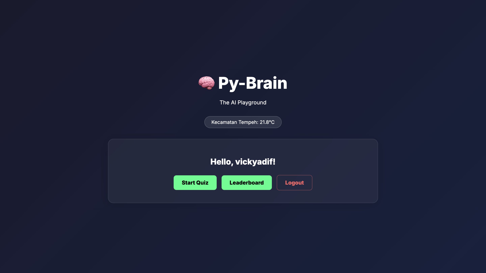
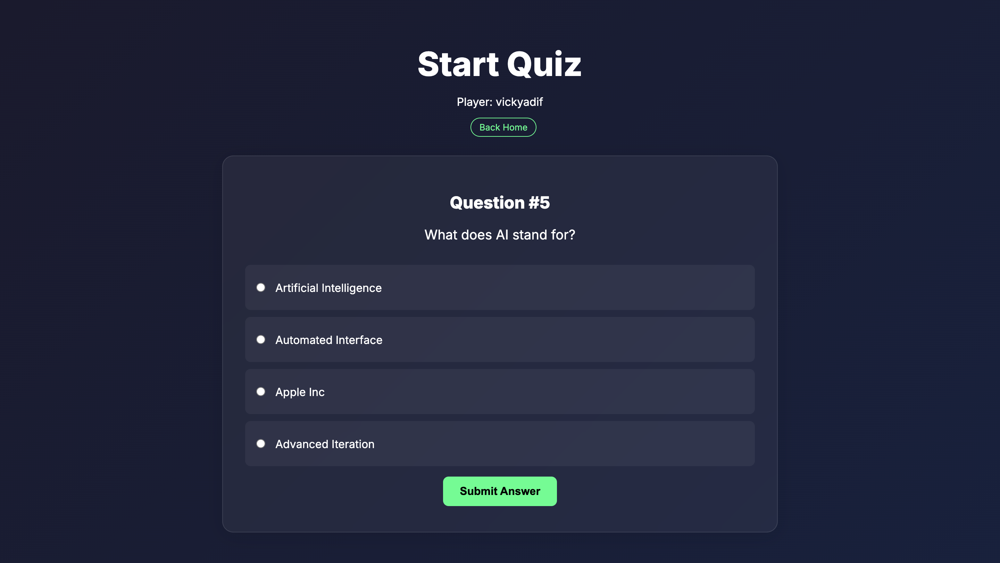

# 🧠 Py-Brain

**Py-Brain** is a Flask-based AI playground designed for learning Python logic, web development, and API integration. It features a cyberpunk-themed quiz, user authentication, and real-time weather integration.



## 🚀 Features

- **User Authentication**: Secure Login and Register system with password hashing.
- **Interactive Quiz**: Test your Python and AI knowledge with random questions.
- **Leaderboard**: Track top scores and compete with others.
- **Dynamic Weather**: Real-time local weather updates using Geolocation and Open-Meteo API.
- **Cyberpunk UI**: A modern, responsive interface with glassmorphism effects.

## 🛠️ Tech Stack

- **Backend**: Python 3, Flask
- **Database**: SQLite
- **Frontend**: HTML5, CSS3 (Custom Glassmorphism), JavaScript
- **API**: Open-Meteo (Weather), BigDataCloud (Reverse Geocoding)

## ⚙️ Local Setup

1.  **Clone the repository** (if applicable) or navigate to the project folder.

2.  **Install Dependencies**:

    ```bash
    pip install -r requirements.txt
    ```

    _Note: `requirements.txt` should contain `Flask`._

3.  **Setup Environment Variables**:
    Create a `.env` file in the root directory:

    ```
    SECRET_KEY=your_secret_key_here
    ```

4.  **Initialize Database**:
    The database will be automatically initialized on the first run, or you can manually ensure the tables exist by running:

    ```bash
    python database.py
    ```

5.  **Run the Application**:

    ```bash
    flask run
    ```

    Or:

    ```bash
    python app.py
    ```

6.  **Open in Browser**:
    Visit `http://127.0.0.1:5000`

## ☁️ Deploy to PythonAnywhere

1.  **Push to GitHub**: Make sure to include `.gitignore` so you don't push `.env` or `database.db`.
2.  **Pull on PythonAnywhere**: Clone your repo in a Bash console.
3.  **Setup Virtualenv**:
    ```bash
    mkvirtualenv --python=/usr/bin/python3.10 my-virtualenv
    pip install -r requirements.txt
    ```
4.  **Configure Environment**:
    Upload your `.env` file manually to the project folder, or set environment variables in the WSGI file.
5.  **Initialize Database**:
    Since `database.db` is not in git, you must create it on the server:
    ```bash
    python database.py
    ```
    _This creates a new empty database on PythonAnywhere._
6.  **Setup Web Tab**:
    - Point Source code to your folder.
    - Set Virtualenv path.
    - Reload!

```
py-brain/
├── app.py              # Main application logic
├── database.py         # Database connection and setup
├── questions.py        # Quiz data
├── static/
│   ├── style.css       # Custom styling
│   └── images/         # Project screenshots/assets
├── templates/          # HTML Templates
│   ├── index.html
│   ├── login.html
│   ├── quiz.html
│   └── leaderboard.html
└── readme.md           # Documentation
```

## 📸 Screenshots

### Quiz Interface



---

_Created for learning and fun._ 🚀
